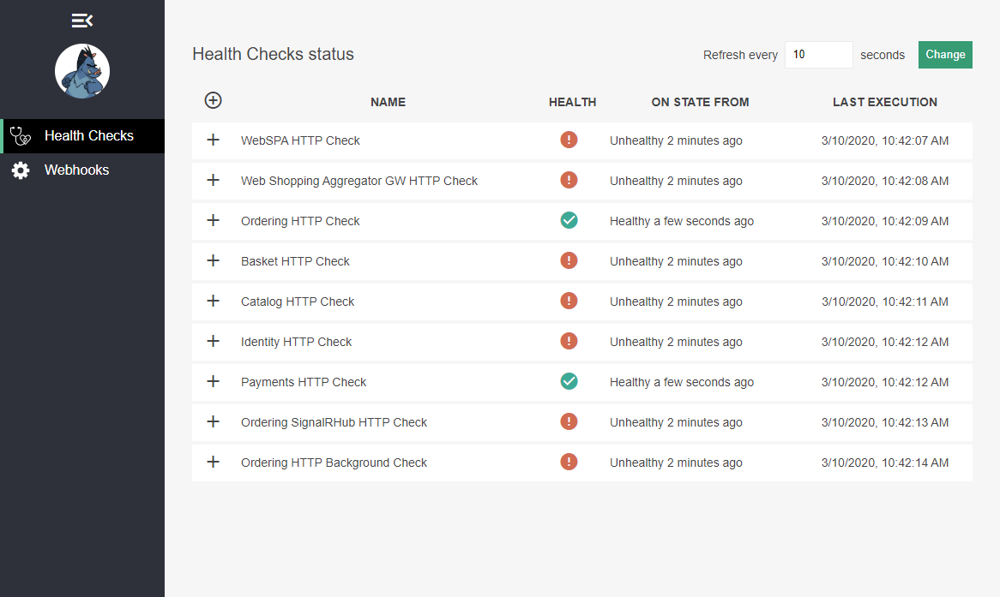

# Deploy to AKS

This document describes the general process in detail to deploy a simplified version of [eShopOnContainers](https://github.com/dotnet-architecture/eShopOnContainers) to an AKS cluster.

This is only required to explore an alternative process.

Check the [Quickstart](README.md) for an streamlined process.

You must complete the [VM build set up procedure](README-build-setup.md) to build and publish the images using a VM from the Azure Cloud Shell.

## Overview

To deploy the starter application to an AKS cluster you must complete the following activities:

1. **Create an Azure Container Registry (ACR)**
   - This will be the repository for the images that will be deployed to AKS
2. **Build and push images to ACR**
   - AKS takes images from public and/or private repositories when deploying apps and services.
3. **Create an Azure Kubernetes Service (AKS) cluster**
   - Creation of the actual cluster, a minimal one-node configuration to start with.
4. **Deploy application to AKS**
   - Deployment of the app components using very simple Helm charts.

## Details

### 1. Create an Azure Container Registry (ACR)

All scripts can take parameters from some environment variables, so it's recommended that you define the variables as instructed in this README.

```bash
cd clouddrive/source/eShop-Learn/deploy/k8s

# Define initial environment variables
export ESHOP_SUBS=xxxxxxxx-xxxx-xxxx-xxxx-xxxxxxxxxxxx
export ESHOP_RG=eshop-learn-rg
export ESHOP_LOCATION=westeurope
```

Notes:

- Use the `az account show` command to get your subscription ID to configure the **ESHOP_SUBS** variable.
- Use the `az rest -u locations --uri-parameters api-version=2019-11-01` command to get the available locations.

After configuring the `ESHOP_SUBS` environment variable, run the following script:

```bash
./create-acr.sh
```

When the script finishes you should get a message similar to this one:

```txt
Created ACR "eshoplearnYYYYMMDDHHMMSS###" in RG "eshop-learn-rg" in location "westeurope".
Login server: eshoplearnYYYYMMDDHHMMSS###.azurecr.io
User Login: eshoplearnYYYYMMDDHHMMSS###
Password: xxxxx

Environment variables
---------------------
export ESHOP_SUBS=xxxxxxxx-xxxx-xxxx-xxxx-xxxxxxxxxxxx
export ESHOP_RG=eshop-learn-rg
export ESHOP_LOCATION=westeurope
export ESHOP_ACRNAME=eshoplearnYYYYMMDDHHMMSS###
export ESHOP_REGISTRY=eshoplearnYYYYMMDDHHMMSS###.azurecr.io
export ESHOP_ACRUSER=eshoplearnYYYYMMDDHHMMSS###
export ESHOP_ACRPASSWORD=xxxxx
export ESHOP_IDTAG=YYYYMMDDHHMMSS###

Commands
--------
- To login Docker to ACR          : docker login eshoplearnYYYYMMDDHHMMSS###.azurecr.io -u eshoplearnYYYYMMDDHHMMSS### -p xxxxx
- To build images and push to ACR : build-and-push.sh --acr eshoplearnYYYYMMDDHHMMSS###.azurecr.io

Run the following command to update the environment
eval $(cat ../../../create-acr-exports.txt)
```

To make the rest of the process easier, execute the following command to set the resulting environment variables. The variables will be used by the rest of the scripts and you'll have to type less 😉

```bash
eval $(cat ../../../create-acr-exports.txt)
```

### 2. Build and push images to ACR

We should be now ready to build the images and publish them to the ACR. At this point you should've completed the [Azure Cloud Shell setup](README-build-setup.md) to build and push from the cloud.

To build and push from the Azure Cloud Shell run the following script:

```bash
./build-and-push.sh
```

This process could takes between 15 and 25 minutes the first time, so while it runs, you can open a new Azure Cloud Shell session to continue with the creation of the AKS cluster.

**NOTE**: The Dockerfiles in this repo are optimized for building the images on a single machine, leveraging on Docker's build image cache.

### 3. Create an Azure Kubernetes Service (AKS) cluster

Since we are opening a new session we don't have any of the required environment variables, so we have to run the following commands:

```bash
cd clouddrive/source/eShop-Learn/deploy/k8s

eval $(cat ../../../create-acr-exports.txt)
```

There are two way to create the AKS cluster:

1. If you are the owner of the subscription or are authorized to create a Service Principal (SP) or
2. You are not authorized to create a SP in the subscription.

If you can (and want to) create a SP for the cluster, just run the script like so:

```bash
./create-aks.sh
```

If you can't create a SP or want to use an existing one, run the script this way:

```bash
./create-aks.sh --appid xxxxxxxx-xxxx-xxxx-xxxx-xxxxxxxxxxxx --password XXXXXXXXXX
```

The `create-aks` script takes care of:

- Creating the service principal if not supplied
- Creating the AKS cluster
- Deploying the ingress controller
- Deploying a load balancer (LB) for the cluster with a public IP

When the script finishes you should get a message like this:

```txt
AKS cluster "eshop-learn-aks" created with LB public IP "###.###.###.###".

Environment variables
---------------------
export ESHOP_SUBS=xxxxxxxx-xxxx-xxxx-xxxx-xxxxxxxxxxxx
export ESHOP_RG=eshop-learn-rg
export ESHOP_LOCATION=westeurope
export ESHOP_ACRNAME=eshoplearnYYYYMMDDHHMMSS###
export ESHOP_REGISTRY=eshoplearnYYYYMMDDHHMMSS###.azurecr.io
export ESHOP_LBIP=###.###.###.###

# Commands:

# - To deploy eShop to AKS: ./deploy-aks.sh --acr eshoplearnYYYYMMDDHHMMSS###.azurecr.io --ip ###.###.###.###

Run the following command to update the environment
eval $(cat ../../../create-aks-exports.txt)
```

Now run the command to update the environment:

```bash
eval $(cat ../../../create-aks-exports.txt)
```

### 4. Deploy application to AKS

Once the AKS cluster has been created and we have the public IP of the load balancer, we can deploy the application with a simple script like so:

```bash
```./deploy-aks.sh
```

The deployment of Helm charts is quite fast and should take less than a minute.

You should see a message like this, including all Helm charts:

```txt
Deploying Helm charts from registry "eshoplearnYYYYMMDDHHMMSS###.azurecr.io"

Installing chart apigateway...
NAME: eshop-apigateway
LAST DEPLOYED: Tue Mar 10 10:16:55 2020
NAMESPACE: default
STATUS: deployed
REVISION: 1
TEST SUITE: None

Installing chart xxxxxxxxxx...
```

When the script finishes you should see something like this:

```txt
Helm charts deployed
NAME                    NAMESPACE       REVISION        UPDATED                                 STATUS          CHART                   APP VERSION
eshop-apigateway        default         1               2020-03-10 10:39:28.781020307 +0000 UTC deployed        apigateway-0.1.0        1.0.0
eshop-backgroundtasks   default         1               2020-03-10 10:39:32.128829119 +0000 UTC deployed        backgroundtasks-0.1.0   1.0.0
eshop-basket            default         1               2020-03-10 10:39:35.49707941 +0000 UTC  deployed        basket-0.1.0            1.0.0
eshop-basketdata        default         1               2020-03-10 10:39:39.162022247 +0000 UTC deployed        basketdata-0.1.0        1.0.0
eshop-catalog           default         1               2020-03-10 10:39:42.851236441 +0000 UTC deployed        catalog-0.1.0           1.0.0
eshop-identity          default         1               2020-03-10 10:39:46.653681166 +0000 UTC deployed        identity-0.1.0          1.0.0
eshop-ordering          default         1               2020-03-10 10:39:50.123248058 +0000 UTC deployed        ordering-0.1.0          1.0.0
eshop-payment           default         1               2020-03-10 10:39:54.009819185 +0000 UTC deployed        payment-0.1.0           1.0.0
eshop-rabbitmq          default         1               2020-03-10 10:39:57.48403975 +0000 UTC  deployed        rabbitmq-0.1.0          1.0.0
eshop-seq               default         1               2020-03-10 10:40:00.979450589 +0000 UTC deployed        seq-0.1.0               1.0.0
eshop-signalr           default         1               2020-03-10 10:40:04.863058535 +0000 UTC deployed        signalr-0.1.0           1.0.0
eshop-sqldata           default         1               2020-03-10 10:40:08.456513695 +0000 UTC deployed        sqldata-0.1.0           1.0.0
eshop-webshoppingagg    default         1               2020-03-10 10:40:12.18945763 +0000 UTC  deployed        webshoppingagg-0.1.0    1.0.0
eshop-webspa            default         1               2020-03-10 10:40:15.827722626 +0000 UTC deployed        webspa-0.1.0            1.0.0
eshop-webstatus         default         1               2020-03-10 10:40:20.110168113 +0000 UTC deployed        webstatus-0.1.0         1.0.0

Pod status
NAME                               READY   STATUS              RESTARTS   AGE
apigateway-6fdcd9774f-jmknc        1/1     Running             0          51s
backgroundtasks-789c89866c-mpllm   0/1     Running             0          48s
basket-c6c76bf4b-zpm2t             0/1     Running             0          45s
basketdata-7f7dd9c6df-9j5v7        1/1     Running             0          41s
catalog-c8f9866d-c6zkf             0/1     Running             1          37s
identity-96644bdf-9rp5w            0/1     Running             1          33s
ordering-5c49c88fdb-rprvh          0/1     Running             1          30s
payment-9c6ff9656-vsqhn            0/1     Running             0          26s
rabbitmq-5b4696c96d-h6bdh          1/1     Running             0          23s
seq-5f4cf6695-z257r                1/1     Running             0          19s
signalr-8558d5f7c7-xgjfv           0/1     Running             0          15s
sqldata-868cddfc54-6g6xj           1/1     Running             0          12s
webshoppingagg-5fbc579768-hczl9    0/1     Running             0          8s
webspa-5d57465dd-ktwwl             1/1     Running             0          4s
webstatus-5c7d58f964-k448k         0/1     ContainerCreating   0          0s

The eShop-Learn application has been deployed.

You can begin exploring these services (when available):
- Centralized logging       : http://###.###.###.###/seq/#/events?autorefresh (See transient failures during startup)
- General application status: http://###.###.###.###/webstatus/ (See overall service status)
- Web SPA application       : http://###.###.###.###/
```

At this point you can probably check the centralized logs at `http://###.###.###.###/seq/#/events?autorefresh` where you'll see all the transient errors that occur during the application startup, until they stop and all services are up and running.

You can also check the general application status at `http://###.###.###.###/webstatus/`



All the services should be up and running in less than five minutes.

We are now ready to dive into microservices development!
