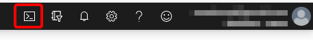
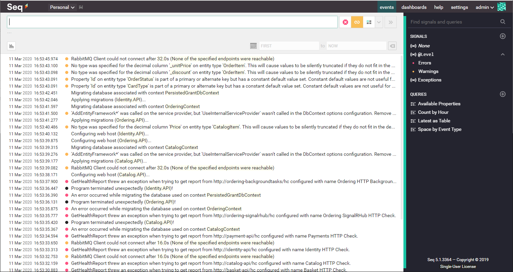

# QUICKSTART

To create an AKS cluster with a starter version of eShop-Learn complete the following steps:

1. Fork the repo <https://github.com/dotnet-architecture/eShop-Learn> in your GitHub account.

2. Open an Azure Cloud Shell session while logged in with your subscription on the Azure portal.

    

3. Create the base source directory

    ```bash
    cd ~/clouddrive
    mkdir source
    cd source
    ```

4. Clone your repo

    ```bash
    git clone https://github.com/{your-github-account}/eShop-Learn.git
    ```

    If asked for a GitHub Login, it's recommended that you generate a personal access token for your account from this page <https://github.com/settings/tokens> and use it as the password.

    It's also recommended that you enable credentials caching with these commands:

    ```bash
    git config --global credential.helper cache
    git config --global credential.helper 'cache --timeout=3600'
    ```

5. Run the quickstart script (change resource group name or location as needed):

    ```bash
    ~/clouddrive/source/eShop-Learn/deploy/k8s/quickstart.sh --resource-group eshop-learn-rg --location westus
    ```

When the script finishes you should see something like this:

```txt
Helm charts deployed
NAME                    NAMESPACE       REVISION        UPDATED                                 STATUS          CHART                   APP VERSION
eshop-apigateway        default         1               2020-03-10 10:39:28.781020307 +0000 UTC deployed        apigateway-0.1.0        1.0.0
eshop-backgroundtasks   default         1               2020-03-10 10:39:32.128829119 +0000 UTC deployed        backgroundtasks-0.1.0   1.0.0
eshop-basket            default         1               2020-03-10 10:39:35.49707941 +0000 UTC  deployed        basket-0.1.0            1.0.0
eshop-basketdata        default         1               2020-03-10 10:39:39.162022247 +0000 UTC deployed        basketdata-0.1.0        1.0.0
eshop-catalog           default         1               2020-03-10 10:39:42.851236441 +0000 UTC deployed        catalog-0.1.0           1.0.0
eshop-identity          default         1               2020-03-10 10:39:46.653681166 +0000 UTC deployed        identity-0.1.0          1.0.0
eshop-ordering          default         1               2020-03-10 10:39:50.123248058 +0000 UTC deployed        ordering-0.1.0          1.0.0
eshop-payment           default         1               2020-03-10 10:39:54.009819185 +0000 UTC deployed        payment-0.1.0           1.0.0
eshop-rabbitmq          default         1               2020-03-10 10:39:57.48403975 +0000 UTC  deployed        rabbitmq-0.1.0          1.0.0
eshop-seq               default         1               2020-03-10 10:40:00.979450589 +0000 UTC deployed        seq-0.1.0               1.0.0
eshop-signalr           default         1               2020-03-10 10:40:04.863058535 +0000 UTC deployed        signalr-0.1.0           1.0.0
eshop-sqldata           default         1               2020-03-10 10:40:08.456513695 +0000 UTC deployed        sqldata-0.1.0           1.0.0
eshop-webshoppingagg    default         1               2020-03-10 10:40:12.18945763 +0000 UTC  deployed        webshoppingagg-0.1.0    1.0.0
eshop-webspa            default         1               2020-03-10 10:40:15.827722626 +0000 UTC deployed        webspa-0.1.0            1.0.0
eshop-webstatus         default         1               2020-03-10 10:40:20.110168113 +0000 UTC deployed        webstatus-0.1.0         1.0.0

Pod status
NAME                               READY   STATUS              RESTARTS   AGE
apigateway-6fdcd9774f-jmknc        1/1     Running             0          51s
backgroundtasks-789c89866c-mpllm   0/1     Running             0          48s
basket-c6c76bf4b-zpm2t             0/1     Running             0          45s
basketdata-7f7dd9c6df-9j5v7        1/1     Running             0          41s
catalog-c8f9866d-c6zkf             0/1     Running             1          37s
identity-96644bdf-9rp5w            0/1     Running             1          33s
ordering-5c49c88fdb-rprvh          0/1     Running             1          30s
payment-9c6ff9656-vsqhn            0/1     Running             0          26s
rabbitmq-5b4696c96d-h6bdh          1/1     Running             0          23s
seq-5f4cf6695-z257r                1/1     Running             0          19s
signalr-8558d5f7c7-xgjfv           0/1     Running             0          15s
sqldata-868cddfc54-6g6xj           1/1     Running             0          12s
webshoppingagg-5fbc579768-hczl9    0/1     Running             0          8s
webspa-5d57465dd-ktwwl             1/1     Running             0          4s
webstatus-5c7d58f964-k448k         0/1     ContainerCreating   0          0s

The eShop-Learn application has been deployed.

You can begin exploring these services (when available):
- Centralized logging       : http://###.###.###.###/seq/#/events?autorefresh (See transient failures during startup)
- General application status: http://###.###.###.###/webstatus/ (See overall service status)
- Web SPA application       : http://###.###.###.###/
```

At this point you can probably check the centralized logs at `http://###.###.###.###/seq/#/events?autorefresh` where you'll see all the transient errors that occur during the application startup, until they stop and all services are up and running.



You can also check the general application status at `http://###.###.###.###/webstatus/`


All the services should be up and running in less than five minutes.

We are now ready to dive into microservices development!
