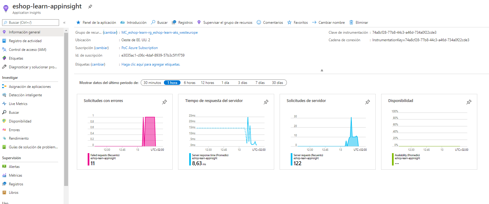
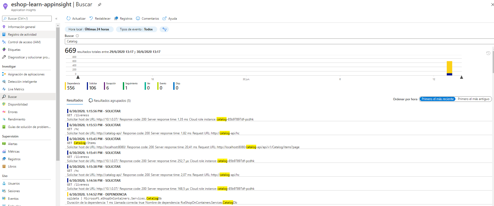

# App Insights

To create app insights for cluster following steps:

Inside the Catalog api install the nuget package "Serilog.Sinks.ApplicationInsights".

Into Program.cs can found CreateSerilogLogger. Add telemetry configuration and serilog sink for appinsights.

```csharp
private static Serilog.ILogger CreateSerilogLogger(IConfiguration configuration)
{
    ...

    var telemetryConfiguration = TelemetryConfiguration.CreateDefault();

    telemetryConfiguration.InstrumentationKey = configuration.GetValue("ApplicationInsights__InstrumentationKey", string.Empty);

    return new LoggerConfiguration()
        .MinimumLevel.Verbose()
        .Enrich.WithProperty("ApplicationContext", AppName)
        .Enrich.FromLogContext()
        .WriteTo.Console()
        .WriteTo.ApplicationInsights(telemetryConfiguration, TelemetryConverter.Traces)// Sink appinsights
        .WriteTo.Seq(string.IsNullOrWhiteSpace(seqServerUrl) ? "http://seq" : seqServerUrl)
        .WriteTo.Http(string.IsNullOrWhiteSpace(logstashUrl) ? "http://logstash:8080" : logstashUrl)
        .ReadFrom.Configuration(configuration)
        .CreateLogger();
}
```
Push image to ACR.

# Azure cloud shell

Add extension to application insights

```
az extension add -n application-insights
```

Create a new appinsights using azure cli indicating name, location and resource group

```
az monitor app-insights component create --app <name> --location <region> -g <resource-group>
```

Get instrumentationKey from new appinsights indicating resource group, this command return instrumentationKey value. Copy it and save for later

```
az monitor app-insights component show -g <resource-group> --query '[].instrumentationKey' -o tsv
```

# Helm configuration
Add to the configmap the environment "INSTRUMENTATIONKEY" of the desired service with the instrumentationKey.

Example file "k8s\helm-simple\catalog\templates\configmap.yaml"

```
...
data:
  ASPNETCORE_ENVIRONMENT: Development
  AzureServiceBusEnabled: "False"
  AzureStorageEnabled: "False"
  ConnectionString: Server=sqldata;Database=Microsoft.eShopOnContainers.Services.CatalogDb;User Id=sa;Password=Pass@word
  EventBusConnection: rabbitmq
  GRPC_PORT: "81"
  OrchestratorType: K8S
  PATH_BASE: /catalog-api
  PicBaseUrl: "{{ .Values.protocol }}://{{ .Values.host }}/apigateway/c/api/v1/catalog/items/[0]/pic/"
  PORT: "80"
  UseCustomizationData: "False"
  INSTRUMENTATIONKEY: "<instrumentation_key>"
```

Use helm list for show all deployments and copy the deployment name, in this case eshoplearn-catalog.

```
@Azure:~$ helm list
NAME                            NAMESPACE       REVISION        UPDATED                                 STATUS          CHART                           APP VERSION
eshoplearn-apigateway           default         1               2020-06-25 09:10:04.2865311 +0100 +0100 deployed        apigateway-0.1.0                1.0.0
eshoplearn-backgroundtasks      default         1               2020-06-24 18:54:22.7343174 +0100 +0100 deployed        backgroundtasks-0.1.0           1.0.0
eshoplearn-basket               default         1               2020-06-24 18:54:25.7563207 +0100 +0100 deployed        basket-0.1.0                    1.0.0
eshoplearn-basketdata           default         1               2020-06-24 18:54:28.2067671 +0100 +0100 deployed        basketdata-0.1.0                1.0.0
eshoplearn-catalog              default         4               2020-06-29 10:44:12.568953169 +0000 UTC deployed        catalog-0.1.0                   1.0.0
eshoplearn-coupon               default         1               2020-06-24 20:11:56.6188475 +0100 +0100 deployed        coupon-0.1.0                    1.0.0
eshoplearn-identity             default         1               2020-06-24 18:54:35.3100861 +0100 +0100 deployed        identity-0.1.0                  1.0.0
eshoplearn-nosqldata            default         1               2020-06-24 18:54:37.7997759 +0100 +0100 deployed        nosqldata-0.1.0                 1.0.0
eshoplearn-ordering             default         1               2020-06-24 18:57:21.3260787 +0100 +0100 deployed        ordering-0.1.0                  1.0.0
eshoplearn-payment              default         1               2020-06-24 18:55:57.6770993 +0100 +0100 deployed        payment-0.1.0                   1.0.0
eshoplearn-rabbitmq             default         1               2020-06-24 18:55:59.8735292 +0100 +0100 deployed        rabbitmq-0.1.0                  1.0.0
eshoplearn-seq                  default         1               2020-06-24 18:56:02.1451448 +0100 +0100 deployed        seq-0.1.0                       1.0.0
eshoplearn-signalr              default         1               2020-06-24 18:56:04.4801555 +0100 +0100 deployed        signalr-0.1.0                   1.0.0
eshoplearn-sqldata              default         1               2020-06-24 18:56:06.8499552 +0100 +0100 deployed        sqldata-0.1.0                   1.0.0
eshoplearn-webshoppingagg       default         1               2020-06-24 20:11:58.8381208 +0100 +0100 deployed        webshoppingagg-0.1.0            1.0.0
eshoplearn-webspa               default         1               2020-06-24 18:56:10.9834105 +0100 +0100 deployed        webspa-0.1.0                    1.0.0
eshoplearn-webstatus            default         1               2020-06-24 18:56:13.4442002 +0100 +0100 deployed        webstatus-0.1.0                 1.0.0
```

Apply the update of the helm file in the service cluster that we have previously copied the name
```
helm upgrade -i eshoplearn-catalog --set imagePullPolicy=Always helm-simple/catalog
```
If the pod does not contain the environment variable. Get out of the pod and delete it. This forces kubernetes to create a new pod and reloads the variables defined in the configmap.
```
kubectl delete pod <catalog-pod>
```
You can access the pod and see if it contains the new environment variable.
```
kubectl exec --stdin --tty <pod> -- /bin/bash
root@catalog-85b97897df-pcdhk:/app# env | grep -i "Appli"
INSTRUMENTATIONKEY=74a8cf28-****-****-****-734a0f22cde3
```
Type exit to exit the pod.

If the pod does not contain the environment variable. Get out of the pod and delete it. This forces kubernetes to create a new pod and reloads the variables defined in the configmap.
```
kubectl delete pod catalog-85b97897df-hjm4f
```
Accessing the appinsights resource we can see the general panel with the default graphics


If we enter the search section, we can filter by name and see the different requests. In this example with catalog.


# Delete appinsights

To remove service execute az cli with this command with params name and resource group.
```
az monitor app-insights component delete --app <name> -g <resource-group>
```